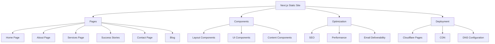
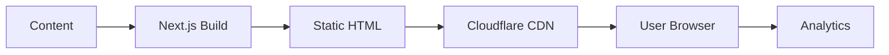

# System Patterns

## System Architecture

## Key Technical Decisions
1. Next.js Static Site Generation
   - Static export for all pages
   - Minimal client-side JavaScript
   - Built-in image optimization
   - Future-proof for dynamic features

2. Component Architecture
   - Modular components for reuse
   - Separation of concerns
   - TypeScript for type safety
   - Responsive design patterns

3. SEO Implementation
   - Semantic HTML structure
   - Meta tag optimization
   - XML sitemap generation
   - Structured data implementation

## Design Patterns in Use
1. Component Patterns
   - Atomic design methodology
   - Container/Presenter pattern
   - Higher-order components
   - Custom hooks for logic

2. Performance Patterns
   - Image optimization
   - Font optimization
   - Code splitting
   - Lazy loading

3. SEO Patterns
   - Semantic HTML
   - Meta tag management
   - Sitemap generation
   - Robots.txt configuration

## Component Relationships
1. Layout Components
   - Header
   - Footer
   - Navigation
   - Page layout

2. UI Components
   - Buttons
   - Cards
   - Forms
   - Typography

3. Content Components
   - Hero sections
   - Service cards
   - Testimonial displays
   - Blog post previews

## Data Flow

## Security Patterns
1. Content Security Policy
   - Strict CSP implementation
   - Resource restrictions
   - Script integrity
   - Frame protection

2. HTTPS
   - TLS 1.3
   - HSTS
   - Secure cookies
   - Mixed content prevention

3. Input Sanitization
   - Form validation
   - XSS prevention
   - CSRF protection
   - Data sanitization 