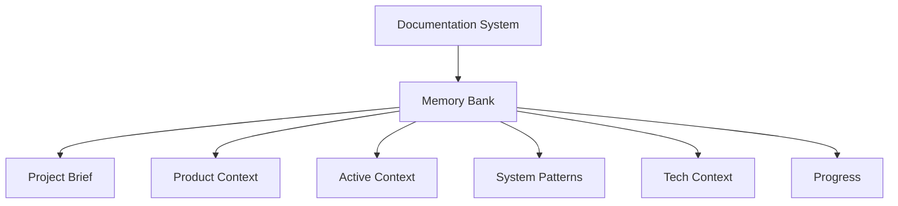
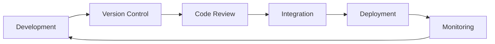

# System Patterns

## System Architecture

## Key Technical Decisions
1. Documentation Management
   - Markdown-based documentation
   - Version-controlled files
   - Centralized memory bank
   - Regular update schedule

2. Development Workflow
   - Git flow branching strategy
   - Pull request reviews
   - Automated quality checks
   - Continuous integration

3. Code Organization
   - Modular architecture
   - Component-based design
   - Clear separation of concerns
   - Consistent file structure

## Design Patterns in Use
1. Documentation Patterns
   - Single source of truth
   - Living documentation
   - Version control integration
   - Automated updates

2. Development Patterns
   - Feature branch workflow
   - Pull request reviews
   - Automated testing
   - Continuous integration

3. Code Patterns
   - Component-based architecture
   - Service layer pattern
   - Repository pattern
   - Factory pattern

## Component Relationships
1. Documentation Components
   - Memory Bank
   - Project Rules
   - Version Control
   - Update System

2. Development Components
   - Branch Management
   - Code Review
   - Quality Assurance
   - Build System

3. Integration Components
   - CI/CD Pipeline
   - Testing Framework
   - Deployment System
   - Monitoring Tools

## Data Flow

## Security Patterns
1. Version Control
   - Branch protection
   - Access control
   - Audit logging
   - Secure commits

2. Code Review
   - Security scanning
   - Dependency checks
   - Vulnerability assessment
   - Compliance verification

3. Deployment
   - Secure configuration
   - Environment isolation
   - Access management
   - Monitoring and alerts 